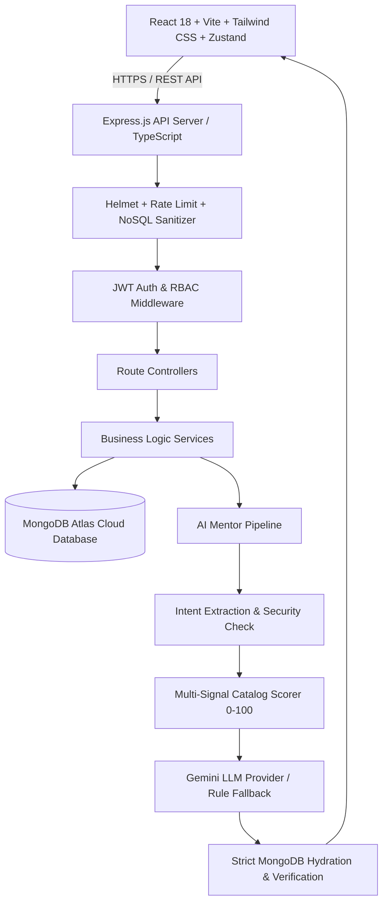

# SkillForge — Production-Grade MERN Learning & AI Career Platform

> **Learn Skills That Actually Move Your Career.**

[](https://skillforge-fullstack-lms.vercel.app/)
[](https://github.com/naina766/skillforge-fullstack-lms)
[](https://www.typescriptlang.org/)
[](https://react.dev/)
[](https://nodejs.org/)
[](https://www.mongodb.com/atlas)

**SkillForge** is a full-stack, production-ready EdTech platform built as a modular monolith. It enables students to discover, enroll in, and complete courses, live workshops, and bootcamps with verifiable certificates and an intelligent, catalog-grounded AI Career Mentor.

🌐 **Live Application:** [https://skillforge-fullstack-lms.vercel.app/](https://skillforge-fullstack-lms.vercel.app/)

---

## 🌟 Key Features

### 🤖 AI Career Mentor & Recommendation Engine
- **Generalized Career Assessment:** Evaluates user goals across 30+ engineering domains (Full Stack, Backend, Frontend, Generative AI, DevOps, Cloud, Cybersecurity, Mobile, Data Science, etc.).
- **Dynamic Skill Gap Engine:** Calculates exact skill gaps comparing stated vs target skills and provisions prerequisite dependency trees.
- **Deterministic Multi-Signal Ranking:** Scores courses (0–100) using a 6-signal weighted formula (Role relevance 30%, Skill coverage 30%, Level match 15%, Prerequisites 10%, Format preference 5%, Outcomes 5%).
- **Strict Catalog Grounding:** Recommendations are 100% verified against MongoDB records (`status === 'PUBLISHED'`) with zero course hallucinations.
- **Progress-Aware Personalization:** Automatically penalizes and excludes already completed or enrolled courses.
- **Security Defenses:** Built-in prompt injection defense, off-topic question redirect, and Zod output schema validation.

### 🎓 Student Experience
- **Faceted Course Discovery:** Real-time search with regex injection defense, category navigation, multi-filter by level (`BEGINNER`, `INTERMEDIATE`, `ADVANCED`) and format (`COURSE`, `WORKSHOP`, `BOOTCAMP`, `WEBINAR`), pricing sliders, and server-side pagination.
- **Server-Side Content Access Control:** Public endpoints expose only preview lessons and safe metadata. Non-preview lesson media identifiers (`youtubeVideoId`, `cloudinaryPublicId`, `cloudinaryUrl`, `videoUrl`, `resources`) are sanitized server-side and accessible only to enrolled learners, course instructors, and administrators.
- **Interactive Learning Player:** Video frame, modular lesson checklist, real-time completion percentage tracking, and automatic certificate generation at 100% progress.
- **Cryptographically Verifiable Digital Certificates:** Deterministic HMAC-SHA256 tamper-proof verification using timing-safe comparison (`crypto.timingSafeEqual`) and a public verification portal with student privacy protection.
- **Student Dashboard:** Enrolled courses, active progress tracking, wishlist bookmarking, and notification inbox.

### 👨‍🏫 Instructor Studio
- **5-Step Course Creation Wizard:** Basic info, pricing & workshop scheduling, curriculum builder with modules/lessons, learning outcomes, and course lifecycle management.
- **Self-Publishing Lifecycle:** Instructors manage their own courses across `DRAFT`, `PUBLISHED`, and `ARCHIVED` states with immediate author ownership verification.
- **Instructor Analytics:** Revenue earnings, total student enrollments, completion rates, and average course ratings computed through database aggregations.

### 🛡️ Admin Control Panel & Production Hardening
- **Platform Analytics:** Real-time database-backed KPI metrics and Recharts visualizations for student growth and category distribution.
- **User & Moderation Controls:** User management, role privilege toggles (`STUDENT`, `INSTRUCTOR`, `ADMIN`), course catalog status oversight, review moderation, and security audit log inspection.
- **Production Hardening:** Helmet HTTP security headers with explicit Content Security Policy (CSP), multi-tier rate limiting (global, auth, AI), NoSQL injection sanitization, and regex search escaping.
- **Hardened Authentication Lifecycle:** Memory-only JWT access tokens (never stored in `localStorage`) paired with secure HttpOnly SameSite refresh cookies, cryptographic session token rotation, and fail-fast production secret validation.
- **Production Seed Guard:** Database seeding is guarded against accidental execution in production; running demo seeds requires explicit `ALLOW_DEMO_SEED=true` opt-in.


---

## 🛠️ Technology Stack

| Layer | Technologies |
|---|---|
| **Frontend** | React 18, Vite, TypeScript, Tailwind CSS, React Router v6, TanStack Query v5, Zustand, React Hook Form, Zod, Axios, Lucide React, Recharts, Framer Motion |
| **Backend** | Node.js, Express.js, TypeScript, MongoDB, Mongoose, JWT, bcryptjs, Zod, Helmet, CORS, express-rate-limit, Pino structured logger |
| **AI Engine** | Google Gemini API (with deterministic rule-based catalog fallback) |
| **Testing** | Vitest, Supertest (Backend API), React Testing Library (Frontend UI) |
| **DevOps & Cloud** | Docker, Docker Compose, Nginx, Vercel, Render, MongoDB Atlas, Swagger/OpenAPI (`/api/docs`) |

---

## 📐 System Architecture



---

## 🔐 Demo Credentials

| Role | Email | Password | Access Level |
|---|---|---|---|
| **Admin** | `admin@skillforge.dev` | `Naina_Admin@741852963` | Full administrative control & platform analytics |
| **Instructor** | `instructor@skillforge.dev` | `Naina_Instructor@741852963` | Course creation wizard & instructor studio |
| **Student** | `student@skillforge.dev` | `Naina_Student@741852963` | Course enrollment, learning player & AI mentor |

---

## 🚀 Quick Start & Local Setup

### 1. Clone Repository
```bash
git clone https://github.com/naina766/skillforge-fullstack-lms.git
cd skillforge-fullstack-lms
```

### 2. Backend Setup
```bash
cd server
npm install
cp .env.example .env    # Configure MONGO_URI and JWT secrets
npm run seed            # Seeds 20 courses, 10 categories & demo accounts
npm run dev             # Starts Express API on http://localhost:5000
```

### 3. Frontend Setup
```bash
cd ../client
npm install
npm run dev             # Starts Vite client on http://localhost:5173
```

### 4. Interactive API Documentation & Health Check
- **OpenAPI / Swagger:** [http://localhost:5000/api/docs](http://localhost:5000/api/docs)
- **Health Check Endpoint:** [http://localhost:5000/api/health](http://localhost:5000/api/health)

---

## 🐳 Docker Deployment

To spin up MongoDB, Express API, and React Nginx client simultaneously:

```bash
docker compose up -d --build
docker compose exec server npm run seed
```
- **Client App:** [http://localhost:80](http://localhost:80)
- **API Server:** [http://localhost:5000](http://localhost:5000)

---

## 🧪 Automated Test Suite

All 93 automated unit and integration tests pass cleanly across backend and frontend workspaces:

```bash
# Run backend API integration tests (Vitest + Supertest)
cd server
npm test

# Run frontend component tests (Vitest + React Testing Library)
cd ../client
npm test
```

### Verified Test Suite Breakdown (93/93 Passed)
- **`server/tests/securityHardening.test.ts` (16/16 passed)** — Public curriculum sanitization (stripping non-preview media and resources for unauthenticated and non-enrolled requests), author and admin full access verification, unpublished draft protection, deterministic HMAC-SHA256 certificate verification with `timingSafeEqual`, student email privacy on public verify, regex metacharacter escaping and ReDoS protection, oversized query/prompt rejection, and configurable `GEMINI_MODEL` validation.
- **`server/tests/rbac.test.ts` (14/14 passed)** — RBAC boundaries, course ownership, lesson curriculum membership validation (`INVALID_LESSON`), private certificate isolation, admin self-demotion/deactivation prevention, and media upload signing authorization.
- **`server/tests/review.test.ts` (12/12 passed)** — Enrollment prerequisites, 1-5 star bounds, unique review constraints, dynamic rating distribution recalculation, and owner-only deletion.
- **`server/tests/video.test.ts` (9/9 passed)** — Multi-pattern YouTube parsing, duration/size bounds (15 min / 500 MB), and Cloudinary signature generation.
- **`server/tests/aiMentor.test.ts` (15/15 passed)** — Multi-role roadmaps, skill gap calculations, prompt injection defense, strict catalog grounding (zero hallucinations), format filters, and completed course exclusion.
- **`server/tests/ai.test.ts` (5/5 passed)** — Length bounds (1-1,000 chars), schema validation, and user profile data isolation.
- **`server/tests/auth.test.ts` (4/4 passed)** — Registration, bcrypt authentication, in-memory access token issuance, and HttpOnly refresh cookie rotation.
- **`server/tests/course.test.ts` (2/2 passed)** — Catalog pagination, filtering, and public endpoints.
- **`client/src/tests/` (16/16 passed)** — StarRating, ReviewCard, CourseRatingSummary, ReviewForm, CourseCard, and AIMessageRenderer component tests.


