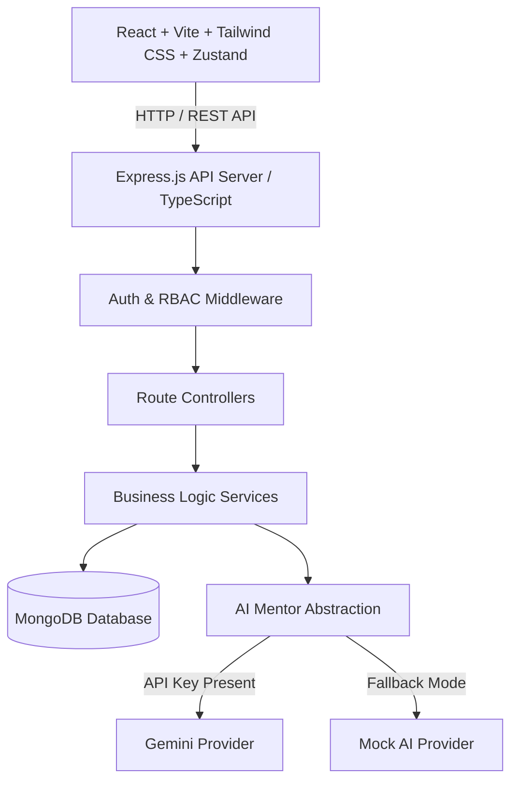

# SkillForge — Production-Grade MERN Learning & Workshop Platform

> **Learn Skills That Actually Move Your Career.**

SkillForge is a full-stack, production-grade EdTech web application built as a portfolio-ready modular monolith. It enables students to discover, enroll in, and complete short courses, live workshops, and bootcamps with verifiable certificates and AI-driven skill path mentoring.

---

## 🌟 Key Features

### 🎓 Student Experience
- **Course Discovery & Faceted Filtering:** Debounced text search, category filtering, level selection, format filters (`COURSE`, `WORKSHOP`, `BOOTCAMP`, `WEBINAR`), price range, multi-option sorting, and server-side pagination.
- **Interactive Learning Player:** Video player frame, sidebar module & lesson tree checklist, real-time completion percentage calculations, and automatic certificate generation upon 100% completion.
- **AI Career Mentor:** Interactive AI assistant delivering skill path guidance and course recommendations backed by the SkillForge database.
- **Verifiable Credentials:** Cryptographically verifiable SHA-256 certificate IDs (`SF-2026-8F72A1`) with public verification check endpoints.
- **Student Dashboard:** Enrolled courses, active progress tracking, wishlist bookmarking, and real-time notification feeds.

### 👨‍🏫 Instructor Studio
- **Multi-Step Course Creation Wizard:** 5-step authoring pipeline (Basic Info, Pricing & Workshop Schedule, Curriculum Module Builder, Learning Outcomes, SEO/Publish Request).
- **Instructor Analytics:** Revenue earnings, total student enrollments, completion rates, and average course ratings.

### 🛡️ Admin Control Panel
- **Platform Analytics:** Real-time KPI metrics and Recharts visualizations for student growth and category distribution.
- **User & Moderation Controls:** Account search/filtering, role privilege toggles, course publishing review workflow, review moderation, and security audit log inspection.

---

## 🛠️ Technology Stack

| Layer | Technologies |
|---|---|
| **Frontend** | React 18, Vite, TypeScript, Tailwind CSS, React Router v6, TanStack Query v5, Zustand, React Hook Form, Zod, Axios, Lucide React, Recharts, Framer Motion |
| **Backend** | Node.js, Express.js, TypeScript, MongoDB, Mongoose, JWT, bcryptjs, Zod, Helmet, CORS, express-rate-limit, Pino structured logger |
| **Testing** | Jest, Supertest (Backend API), Vitest, React Testing Library (Frontend UI) |
| **DevOps & Docs**| Docker, Docker Compose, GitHub Actions CI, Swagger/OpenAPI (`/api/docs`), Cloudinary fallback |

---

## 📐 System Architecture



---

## 🔐 Demo Accounts

| Role | Email | Password |
|---|---|---|
| **Admin** | `admin@skillforge.dev` | `Admin@123456` |
| **Instructor** | `instructor@skillforge.dev` | `Instructor@123456` |
| **Student** | `student@skillforge.dev` | `Student@123456` |

---

## 🚀 Quick Start & Local Setup

### 1. Prerequisites
- Node.js v20+ installed
- MongoDB instance running locally on `mongodb://localhost:27017` (or via Docker)

### 2. Backend Setup
```bash
cd server
npm install
cp .env.example .env
npm run seed     # Populates DB with 20+ realistic courses & demo accounts
npm run dev      # Starts Express API at http://localhost:5000
```

### 3. Frontend Setup
```bash
cd client
npm install
npm run dev      # Starts Vite client at http://localhost:5173
```

### 4. Interactive Swagger Documentation
Open [http://localhost:5000/api/docs](http://localhost:5000/api/docs) to view the OpenAPI REST API specification.

---

## 🐳 Docker Deployment

To spin up MongoDB, Express API, and React Nginx client containers simultaneously:

```bash
docker-compose up --build
```
- Client App: [http://localhost:80](http://localhost:80)
- API Server: [http://localhost:5000](http://localhost:5000)

---

## 🧪 Testing Strategy

### Run Backend Integration Tests
```bash
cd server
npm test
```

### Run Frontend Component Tests
```bash
cd client
npm test
```

---

## 📄 License
Licensed under the MIT License. Built for portfolio demonstration.
